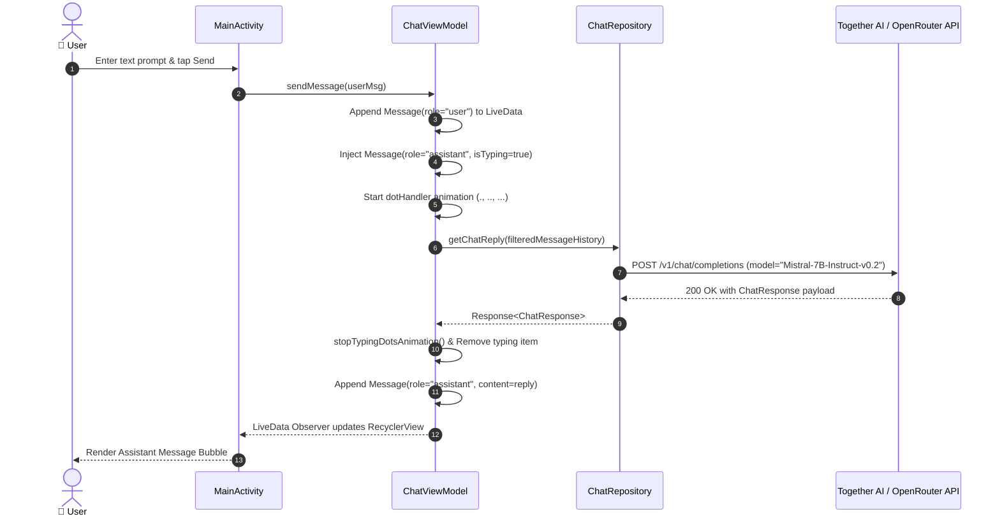

# 🌌 NovaAI — Intelligent Android Conversational AI Assistant

[](https://developer.android.com)
[](https://kotlinlang.org/)
[](https://developer.android.com/topic/architecture)
[](https://mistral.ai/)
[](https://www.together.ai/)
[](LICENSE)

> **NovaAI** is an AI mobile conversational assistant engineered for Android using Kotlin and MVVM. It delivers responsive natural language conversations by interfacing with advanced open-weight Large Language Models (LLMs) such as Mistral-7B via low-latency inference APIs.

---

## 📖 Overview

As Large Language Models become integral to everyday workflows, high-performance mobile interfaces that handle real-time streaming, token generation states, and network resiliency are paramount.

**NovaAI** delivers a clean, responsive mobile chat client built on **Modern Android Architecture (MVVM)**, **Kotlin Coroutines**, and **Retrofit2**. It communicates with high-throughput inference endpoints (Together AI / OpenRouter), formatting full conversational context histories, simulating natural typing cadence with animated dot state machines, and presenting responses through custom Material 3 chat bubbles.

---

## 🏗️ Architecture & Interaction Flow

NovaAI implements a unidirectional MVVM design pattern separating UI rendering from network orchestration:

```mermaid
flowchart TD
    subgraph UI ["Presentation Layer (Activity + RecyclerView)"]
        MA["MainActivity"]
        CA["ChatAdapter (UserBubble vs BotBubble)"]
        TD["Typing Dots State Machine (Handler / Looper)"]
    end

    subgraph ViewModel ["ViewModel & State Layer"]
        CVM["ChatViewModel (viewModelScope)"]
        MLD["MutableLiveData<List<Message>>"]
    end

    subgraph Data ["Data & Networking Layer"]
        CR["ChatRepository"]
        RC["RetrofitClient (OkHttp Interceptors)"]
        AS["ApiService (/v1/chat/completions)"]
    end

    subgraph Remote ["Inference Engine (Cloud LLM)"]
        LLM["Mistral-7B-Instruct-v0.2 (Together AI / OpenRouter)"]
    end

    MA -->|Send Prompt / Speech| CVM
    CVM -->|Append User Message & Start Dots| MLD
    MLD -->|Observe Changes| CA
    CA --> MA
    TD -.->|Pulse . .. ...| MLD

    CVM -->|Execute with Clean History| CR
    CR --> RC
    RC --> AS
    AS -->|HTTP POST JSON Payload| LLM
    LLM -->>|ChatResponse Choices| AS
    AS -->> CR
    CR -->> CVM
    CVM -->|Replace Typing Node with Reply| MLD
```

### Conversational Lifecycle Sequence



---

## ✨ Core Features

- 🧠 **Mistral-7B LLM Integration**: Pre-configured to harness `mistralai/Mistral-7B-Instruct-v0.2` for contextual, coherent, and fast conversational intelligence.
- ⏳ **Dynamic Typing Indicator**: Multi-phase dot state animation (`.` ➔ `..` ➔ `...`) managed by a dedicated `Handler` and `Looper` on the main thread.
- 📜 **Contextual History Retention**: Automatically aggregates conversation history into standard OpenAI-compatible message arrays (`system`, `user`, `assistant`).
- 🎨 **Material 3 Bubble Layout**: Clean separation of user and bot message bubbles with custom gradient drawables, timestamps, and copy actions.
- ⚡ **Asynchronous Coroutine Dispatch**: Asynchronous API invocation utilizing Kotlin `viewModelScope` to ensure 60fps UI responsiveness.
- 🛡️ **Resilient Network Layer**: Configured with OkHttp `HttpLoggingInterceptor` and dynamic header injection for authentication tokens.

---

## 📱 Key Screens & Modules

| Module / Component | Purpose | Key Implementation Details |
|---|---|---|
| **`MainActivity`** | Primary chat viewport and user input anchor | Implements ViewBinding, RecyclerView binding, text input handling, and send triggers |
| **`ChatViewModel`** | State management and conversational lifecycle | Manages `LiveData<List<Message>>`, typing animations, and coroutine execution |
| **`ChatAdapter`** | Dynamic multi-viewtype chat list | Handles user bubbles (`bg_user_bubble.xml`) and bot bubbles (`bg_bot_bubble.xml`) |
| **`ChatRepository`** | API abstraction and model configuration | Encapsulates request formation and default model constants |
| **`RetrofitClient` & `ApiService`** | Network client and REST endpoint declaration | Configures base URL, OkHttpClient with bearer token interceptors, and lenient Gson parsing |

---

## 🛠️ Technology Stack

| Layer / Component | Technology | Version | Purpose |
|---|---|---|---|
| **Platform** | Android | Compile SDK `35` / Min SDK `24` | Modern Android compatibility |
| **Language** | Kotlin | `2.0+` | Core application programming language |
| **Architecture** | MVVM | Lifecycle `2.8+` | Reactive separation of UI and domain logic |
| **Networking** | Retrofit 2 | `2.9.0` | Type-safe REST client for LLM completions |
| **HTTP Engine** | OkHttp 3 / 4 | `4.12.0` | Connection pooling and header interceptors |
| **Serialization** | Gson | `2.9.0` | JSON request/response marshaling |
| **Concurrency** | Kotlinx Coroutines | `1.8+` | Asynchronous non-blocking background tasks |
| **Animations** | Lottie Android | `6.0.1` | Vector animations and splash transitions |
| **UI Components** | AndroidX Material 3 & ConstraintLayout | `1.10.0` / `2.1.4` | Adaptive responsive layout surfaces |

---

## 🚀 Getting Started

### Prerequisites

- **Android Studio Ladybug (2024.2+)** or newer.
- **JDK 11 or JDK 17**.
- An API Key from [Together AI](https://api.together.xyz/) or [OpenRouter](https://openrouter.ai/).

### API Key Configuration

Update your API credentials in `app/src/main/java/com/nayab/aichat/api/RetrofitClient.kt`:
```kotlin
private const val BASE_URL = "https://api.together.xyz/"
private const val OPENROUTER_API_KEY = "YOUR_INFERENCE_API_KEY"
```

### Build & Run

1. Clone the repository:
   ```bash
   git clone https://github.com/shayann07/NovaAI.git
   cd NovaAI
   ```
2. Build via Gradle:
   ```bash
   ./gradlew assembleDebug
   ```
3. Install and run on an Android device or emulator:
   ```bash
   ./gradlew installDebug
   ```

---

## 📄 License

This project is licensed under the [MIT License](LICENSE) — Copyright (c) 2026 [shayann07](https://github.com/shayann07).
